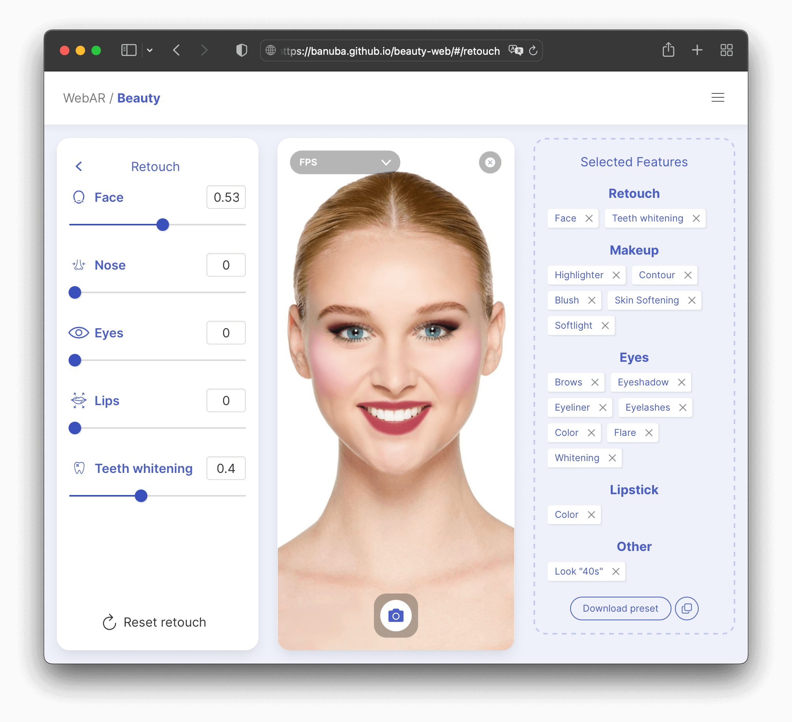

# WebAR/Beauty demo app

Try it Live: [banuba.github.io/beauty-web](https://banuba.github.io/beauty-web)



The demo app is built on top of [Banuba WebAR SDK](https://docs.banuba.com/face-ar-sdk-v1/web/web_overview) and [Makeup](https://docs.banuba.com/face-ar-sdk-v1/effect_api/makeup) effect. It reveals common patterns of consuming the [WebAR SDK JavaScript API](https://docs.banuba.com/face-ar-sdk-v1/generated/typedoc/) as well as the [Makeup effect API](https://docs.banuba.com/face-ar-sdk-v1/effect_api/makeup).

Investigation of the app codebase can give you ready to go snippets for common tasks like:

- [Preloading of WebAR modules](index.html#L61-L65)
- [Preloading of a WebAR effect](index.html#L66)
- [Using different image inputs](index.html#L94-101)
- [Taking screenshots](index.html#102-105)
- [Optimizing WebAR for HiDPI devices](index.html#L58)
- [Applying of user provided images as Background texture](index.html#L123)
- [Invoking Makeup effect APIs](index.html#L125)

Dig into the app for inspiration!

## Running locally

Clone the repository:

```sh
git clone git@github.com:Banuba/beauty-web.git
```

Navigate to the cloned folder:

```sh
cd beauty-web
```

Run the `live-server` in the cloned folder

```sh
npx live-server
```

\* [Nodejs](https://nodejs.org/en/) must be installed to run the `npx live-server` command

Open [localhost:8080](http://localhost:8080) and start clicking :)

---

If you're going to deploy the demo app on your infrastructure, replace the default Banuba Client token with yours one in the `BanubaClientToken.js` file:

```js
window.BANUBA_CLIENT_TOKEN = "PUT YOUR CLIENT TOKEN HERE"
```

Refer to the [Obtaining Banuba Client token](#obtaining-banuba-client-token) section for details.

## Obtaining Banuba SDK Web AR

The example uses CDN version of the [@banuba/webar](https://www.npmjs.com/package/@banuba/webar) npm package for simplicity. Please use the npm package mentioned above for real-world projects. Check out the [Integration tutorials](https://docs.banuba.com/face-ar-sdk-v1/web/web_tutorials_integrations) for more ways of consuming [@banuba/webar](https://www.npmjs.com/package/@banuba/webar) package.

## Obtaining Banuba Client token

Banuba Client token is required to get Banuba SDK Web AR working.

To receive a new **trial** client token, please fill in the [form on banuba.com](https://www.banuba.com/face-filters-sdk) website, or contact us via [info@banuba.com](mailto:info@banuba.com).

## Learn more

Banuba WebAR SDK:

- [High-level WebAR overview](https://docs.banuba.com/face-ar-sdk-v1/web/web_overview)
- [Tutorials for common use-cases](https://docs.banuba.com/face-ar-sdk-v1/web/web_tutorials_basic)
- [Integration tutorials](https://docs.banuba.com/face-ar-sdk-v1/web/web_tutorials_integrations)
- [Optimization tutorials](https://docs.banuba.com/face-ar-sdk-v1/web/web_tutorials_optimizations)

Banuba Makeup Effect:

- [Makeup API overview](https://docs.banuba.com/face-ar-sdk-v1/effect_api/makeup)
- [Face Beauty API overview](https://docs.banuba.com/face-ar-sdk-v1/effect_api/face_beauty)
